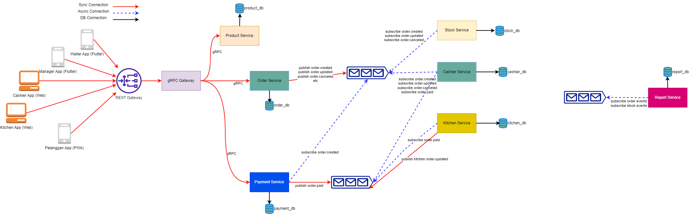

## Aplikasi Rumah Makan
Aplikasi Rumah Makan yang dibuat untuk memudahkan pelanggan dalam melakukan pemesanan, fungsi utama dari aplikasi ini adalah agar pelanggan tidak perlu antri ketika memesan makanan dan bisa mentracking status pesanannya. Sedangkan untuk sisi management, dapat melakukan pemantauan stock, total transaksi dan kinerja pegawai.

### Technical Stack
- GO
- ReactJS (Next.JS)
- Flutter
- Postgresql / MySQL
- Message Broker: RabbitMQ / Kafka
- gRPC
- Restful API
- Docker & Kubernetes

Aplikasi Rumah Makan terdiri dari 5 aplikasi diantaranya: Pelanggan App, Manager App, Waiter App, Cashier App, Kitchen App

### Pelanggan App
Progressive Web App (PWA) dimana pelanggan tidak perlu menginstall aplikasi di handphone nya, cukup menscan QR-code yg ada di meja dan buka link tersebut, maka pelanggan sudah bisa mulai membuat pesanan, tracking, dan melakukan pembayaran.

Kenapa menggunakan PWA dan tidak menggunakan Native atau Hybrid seperti Flutter, karena jika kita memposisikan diri sebagai pelanggan yg hanya datang mungkin sekali atau dua kali ke rumah makan ini, maka akan sangat merepotkan jika harus menginstall aplikasi hanya untuk melakukan pemesanan 😢.

### Manager App
Sebuah applikasi Android/IOS yg dibuat menggunakan Flutter, aplikasi ini dibuat agar manager dapat dengan mudah melihat laporan dan memantau kinerja pegawai dimanapun dia berada.

Kenapa menggunakan Flutter dan tidak Native Android/IOS, dikarenakan jika menggunakan native biaya pembuatan akan mahal jika dibandingkan hybrid, meskipun memang secara performa hybrid kalah jika dibandingkan dengan native.

### Waiter App
Sebuah aplikasi Android/IOS, aplikasi ini digunakan oleh pelayan untuk memantau order yg sudah siap dihidangkan ke pelanggan.

### Cashier App
Dibuat menggunakan NextJS, Cashier app memiliki fitur untuk membuat pesanan, membayar pesanan, update pesanan

### Kitchen App
Fitur utamanya yaitu mengupdate pesanan yg sudah siap dihidangkan, dan menerima pesanan yg sudah dibayar.

#### gRPC
digunakan untuk komunikasi antar microservice secara synchronous, menggunakan gRPC karena gRPC di klaim memiliki performa yang lebih cepat dan sudah menggunakan HTTP/2, perbandingan dengan HTTP/1 bisa dilihat disini https://imagekit.io/demo/http2-vs-http1

#### Message Broker
digunakan untuk komunikasi secara asynchronous antar service, ada dua pilihan yg cukup populer yaitu RabbitMQ dan Kafka. secara singkat perbedaan keduanya yaitu jika RabbitMQ mudah untuk diinstall dan digunakan namun memiliki performa yang kalah jika dibandingkan dengan Kafka

#### Restful API
karena mudah digunakan, sudah familiar dikalangan developer.

#### Architecture

#### Flow Aplikasi:
1. Pelanggan datang ke rumah makan dan mencari meja
2. Di meja sudah tersedia QR-code dan instruksi cara pemesanan
3. Pelanggan menscan QR-code tersebut dan membuka PWA dan kemudian memesan dari situ
4. ketika pelanggan sudah beres memilih, maka dia akan klik pesan, maka pesanannya akan muncul di Kasir dengan status unpaid, selama status unpaid maka pesanan dapat dibatalkan dan diedit
5. kemudian pelanggan bisa memilih untuk melakukan pembayaran di kasir secara cash atau cashless menggunakan Gopay, ovo, dll
6. kemudian setelah pelanggan selesai melakukan pembayaran maka pesanannya akan muncul di kichen-app, dan akan pesanannya akan segera disiapkan
7. setelah pesanannya siap untuk dihidangkan, petugas di bagian kitchen akan mengupdate status pesanannya menjadi ready-to-serve
8. setelah itu akan muncul notifikasi ke pelayan bahwa ada pesanan yg ready-to-serve
9. maka pelayan pun mengambil pesanan tersebut dan menghidangkannya ke pelanggan dan update status pesanan menjadi served
10. (Optional) kemudian setelah pelanggan selesai, maka dia bisa memberikan penilaian terhadap pelayanan Rumah Makan ini.
11. Selesai.